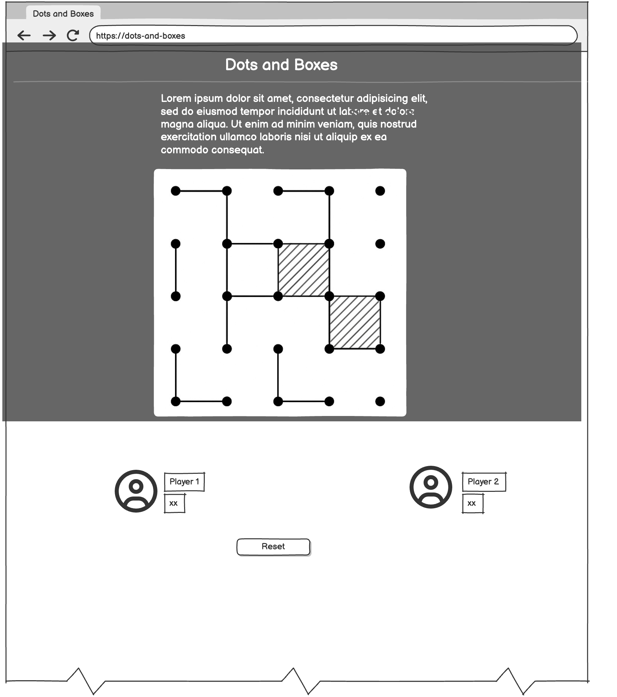
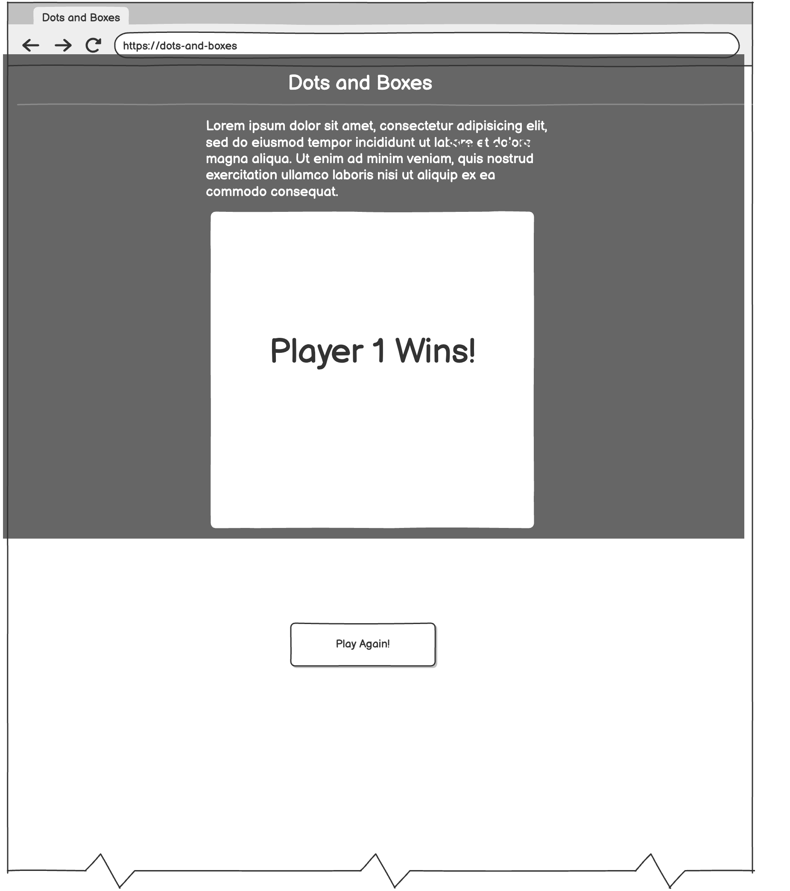

# Dots and boxes

## Description

**Dots and Boxes** will be a two-player strategy game where players take turns connecting dots to complete boxes. The player who completes a box claims it and gets another turn. The objective is to finish the game with the most boxes.

---

## Technologies Planned

- **HTML5**
- **CSS3**
- **JavaScript**

---

## Approach to Be Taken

The project will begin with structuring the basic HTML elements for the game interface. A grid of dots will be dynamically rendered, and players will interact with the grid by clicking to draw horizontal or vertical lines between the dots. Game logic will be implemented to detect when a box is completed and to switch turns accordingly.

The interface will display turn indicators, scoreboards, and a restart option. JavaScript will be used for logic handling, and CSS for styling and responsiveness. HTML elements such as `div`s and `spans` will be used to visually construct the game board.

---

## Planned Features

- Turn-based two-player gameplay
- Visual feedback for selected lines
- Score tracking and win announcement
- Reset button

---

## Wireframe

---

## Stretch Goals

- Option to select board size (will start with 5x5 only)
- Add a computer opponent with basic AI

---

## Project Planning

**[Trello Board](https://trello.com/b/5XCmM7b6/dots-and-boxes)**

**[Git Hub](https://github.com/Diana961216/Dots-and-boxes-planning)**
